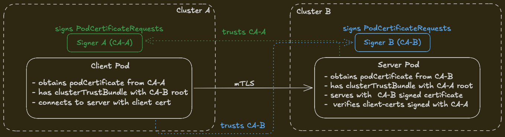

# Cross-Cluster mTLS Demo

Demonstrates Kubernetes 1.35 `PodCertificateRequest` and `ClusterTrustBundle` APIs for automated cross-cluster mutual TLS without sidecars or init containers. Detailed information can be found at kubernetes [Certificates and Certificate Signing Requests](https://kubernetes.io/docs/reference/access-authn-authz/certificate-signing-requests/) page.

## Architecture



## Quick Start

```bash
./setup.sh
```

This sample script spins up 2 kind clusters with the following feature gates enabled.

```yaml
featureGates:
  PodCertificateRequest: true
  ClusterTrustBundle: true
  ClusterTrustBundleProjection: true
runtimeConfig:
  "certificates.k8s.io/v1beta1": "true"
```
- `PodCertificateRequest` — enables the `PodCertificateRequest` API and kubelet volume plugin
- `ClusterTrustBundle` — enables the `ClusterTrustBundle` API
- `ClusterTrustBundleProjection` — enables `clusterTrustBundle` projected volume sources


It then generates CA keypairs for each cluster. There are 3 container images to build: the signer controller, the server, and the client.
The signer controller is deployed to both clusters, while the client and server pods are deployed to `cluster-a` and `cluster-b` respectively.
Both server and client pods use `podCertificate` projected volumes to obtain their TLS credentials, and `clusterTrustBundle` projected volumes to obtain the remote CA certificate for verification.
Finally, the client connects to the server over mTLS and verifies successful communication.

### Pod Certificate Requests

When a pod with a `podCertificate` volume mounts, kubelet generates an ECDSA P-256 keypair and
creates a `PodCertificateRequest` (PCR) object. Then the signer controller watches for PCRs,
extracts the PKIX public key, issues a certificate, and writes the PEM-encoded cert chain
to `status.certificateChain`. Kubelet detects the issued certificate, mounts it into the pod
as a single PEM bundle (private key + cert chain), and refreshes it before expiration.

The controller exposes a **single signer name** — `sample.io/signer` — and lets
pods opt into a serving cert via the `sample.io/eku` user annotation, which
kubelet copies verbatim from `podCertificate.userAnnotations` into
`spec.unverifiedUserAnnotations` on the PCR:

| `sample.io/eku` value | ExtKeyUsage | DNS SAN | Used by |
| --- | --- | --- | --- |
| _absent_ (default) | `clientAuth` | none | client pods |
| `serving` | `serverAuth` | `<podName>.<namespace>` | server pods |
| `both` | `clientAuth` + `serverAuth` | `<podName>.<namespace>` | dual-role pods |

Server pod (cluster-b):

```yaml
volumes:
- name: tls
  projected:
    sources:
    - podCertificate:
        signerName: "sample.io/signer"
        keyType: ECDSAP256
        credentialBundlePath: server-creds.pem
        userAnnotations:
          sample.io/eku: serving
    - clusterTrustBundle:
        signerName: "sample.io/signer"
        labelSelector:
          matchLabels:
            usage: remote-ca
        path: client-ca.pem
```

The client pod is identical minus the `userAnnotations` block, so it gets the
default `clientAuth` cert. The trust bundle carries the peer cluster's CA and
is selected by the `usage: remote-ca` label rather than by signer name.

### ClusterTrustBundle Distribution

Each cluster holds the other cluster's CA certificate in a signer-linked `ClusterTrustBundle`.
Pods project this into their filesystem via `clusterTrustBundle` volume sources, enabling verification of peer certificates
signed by the remote CA.

### Signer Controller

In KEP-4317, the signer controller is needed to implement the signing logic for `PodCertificateRequest` objects, since no built-in signer exists.
The built-in signers in Kubernetes only support `CertificateRequest` objects, which are cluster-scoped and not designed for the pod-specific use case.

The `PodCertificateRequest` API has no requester-side field for declaring intended
key usage, so the signer alone decides what `ExtKeyUsage` to put on each issued
cert. This controller keeps a single signer name (`sample.io/signer`) and reads
`spec.unverifiedUserAnnotations["sample.io/eku"]` — which kubelet copies from
`podCertificate.userAnnotations` — to select the EKU:

- absent → `ExtKeyUsage: ClientAuth`, no SANs (safe default)
- `serving` → `ExtKeyUsage: ServerAuth`, includes `DNSNames`
- `both` → `ExtKeyUsage: ClientAuth + ServerAuth`, includes `DNSNames`
- any other value → PCR is denied with `InvalidRequest`

Client is the default so a pod cannot grant itself server identity by accident.
Because `unverifiedUserAnnotations` is unauthenticated, treat this as a
convenience for the demo — production signers should authorize the requesting
pod (via `spec.serviceAccountName` / `spec.podName`) before honoring
`serving` or `both`.

## Notes

- **No built-in signer exists** for `PodCertificateRequest` — a custom signer controller is required (see [KEP-4317](https://github.com/kubernetes/enhancements/tree/master/keps/sig-auth/4317-pod-certificates))
- Kubelet uses exponential backoff on volume mount failures, so pods may take 2-4 minutes to start after the certificate is issued
- The reference signer implementation from the KEP authors is at [ahmedtd/mesh-example](https://github.com/ahmedtd/mesh-example)
- `PodCertificateRequest` in K8s 1.35 uses `spec.pkixPublicKey` (the `stubPKCS10Request` field was added in a later version)
